## Evaluating the assemblies through comparisons

A common question to ask after finishing a de novo assembly is how does my new draft sequence looks like compared to either a reference genome or a previously created assembly.

To answer this question, we will use **mummerplot** to align two sequence files to each other and create a nice plot based on these alignments.

The first step is to align two fasta files using **nucmer**. Based on these alignment **mummerplot** will provide a PNG image with the matching regions, colored based on the identity score.

~~~
./tools/mummer-4.0.0beta2/nucmer
~~~
{: .bash}

~~~
./tools/mummer-4.0.0beta2/mummerplot
~~~
{: .bash}

> ## Comparison to cultivar reference genome
> Use both applications to compare the three assemblies to the reference sequence:
>~~~
> ./data/references/reference1MB.fasta
>~~~
>{: .bash}
> > ## PacBio vs. reference genome
> >~~~
> >mkdir ./results/mummer
> >./tools/mummer-4.0.0beta2/nucmer ./data/references/reference1MB.fasta ./results/canu_pacbio/canu_pacbio.contigs.fasta --delta=./results/mummer/ref_pacbio.delta
> >./tools/mummer-4.0.0beta2/mummerplot  --color --medium --filter --layout -R ./data/references/reference1MB.fasta -Q ./results/canu_pacbio/canu_pacbio.contigs.fasta --prefix ./results/mummer/ref_pacbio --fat --png ./results/mummer/ref_pacbio.delta
> >~~~
> >{: .bash}
> >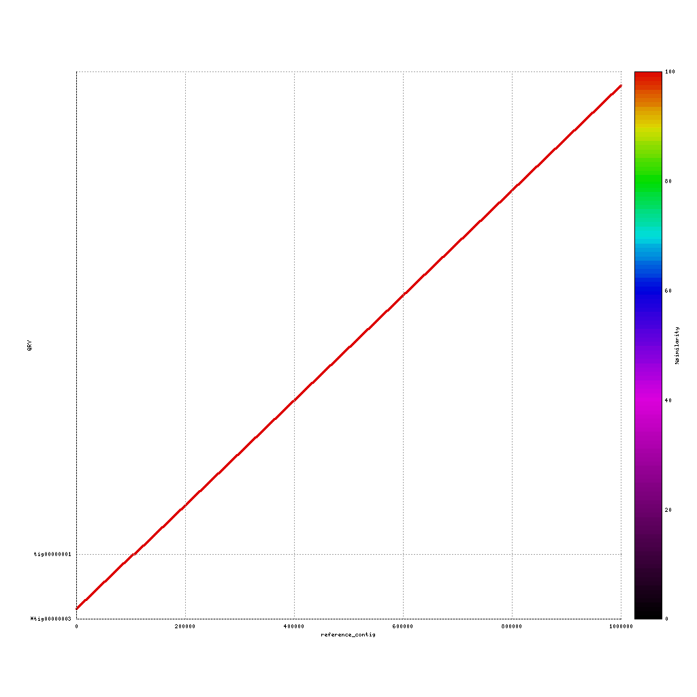
> {: .solution}
> > ## Nanopore vs. reference genome
> >~~~
> >./tools/mummer-4.0.0beta2/nucmer ./data/references/reference1MB.fasta ./results/canu_nanopore/canu_nanopore.contigs.fasta --delta=./results/mummer/ref_nanopore.delta
> >./tools/mummer-4.0.0beta2/mummerplot  --color --medium --filter --layout -R ./data/references/reference1MB.fasta -Q ./results/canu_nanopore/canu_nanopore.contigs.fasta --prefix ./results/mummer/ref_nanopore --fat --png ./results/mummer/ref_nanopore.delta
> >~~~
> >{: .bash}
> >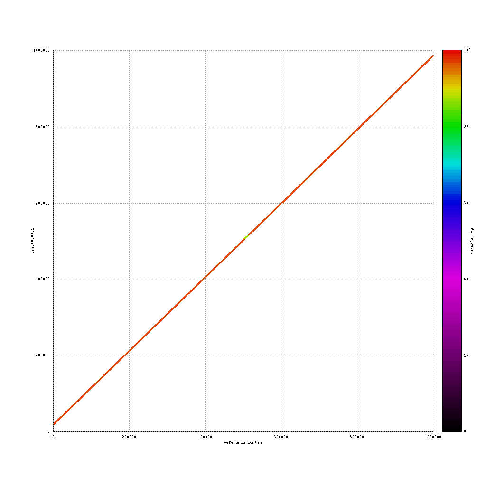
> {: .solution}
> > ## Illumina vs. reference genome
> >~~~
> >./tools/mummer-4.0.0beta2/nucmer ./data/references/reference1MB.fasta ./results/illumina_assembly_contig.fa  --delta=./results/mummer/ref_illumina.delta
> >./tools/mummer-4.0.0beta2/mummerplot  --color --medium --filter --layout -R ./data/references/reference1MB.fasta -Q ./results/illumina_assembly_contig.fa  --prefix ./results/mummer/ref_illumina --fat --png ./results/mummer/ref_illumina.delta
> >~~~
> >{: .bash}
> >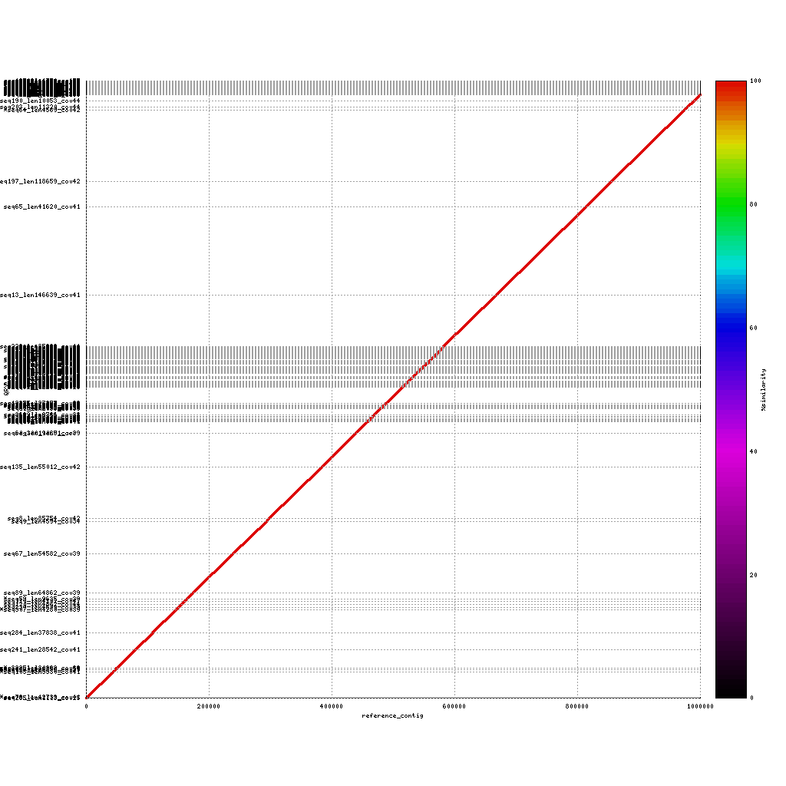
> {: .solution}
> Now discuss:
> 
> 1. What do you see? 
> 2. Are the assemblies similar to the reference or not? And why (not)?
> 3. Which sequencing platform do you prefer?
{: .challenge}

> ## Comparison to TAIR10 reference genome
> Use both applications to compare the three assemblies to the reference sequence:
>~~~
> ./data/references/TAIR10_reference1MB.fasta
>~~~
> > ## PacBio vs. TAIR10
> >~~~
> >./tools/mummer-4.0.0beta2/nucmer ./data/references/TAIR10_reference1MB.fasta ./results/canu_pacbio/canu_pacbio.contigs.fasta --delta=./results/mummer/tair10_pacbio.delta
> >./tools/mummer-4.0.0beta2/mummerplot  --color --medium --filter --layout -R ./data/references/TAIR10_reference1MB.fasta -Q ./results/canu_pacbio/canu_pacbio.contigs.fasta --prefix ./results/mummer/tair10_pacbio --fat --png ./results/mummer/tair10_pacbio.delta
> >~~~
> >{: .bash}
> >
> {: .solution}
> > ## Nanopore vs. TAIR10
> >~~~
> >./tools/mummer-4.0.0beta2/nucmer ./data/references/TAIR10_reference1MB.fasta ./results/canu_nanopore/canu_nanopore.contigs.fasta --delta=./results/mummer/tair10_nanopore.delta
> >./tools/mummer-4.0.0beta2/mummerplot  --color --medium --filter --layout -R ./data/references/TAIR10_reference1MB.fasta -Q ./results/canu_nanopore/canu_nanopore.contigs.fasta --prefix ./results/mummer/tair10_nanopore --fat --png ./results/mummer/tair10_nanopore.delta
> >~~~
> >{: .bash}
> >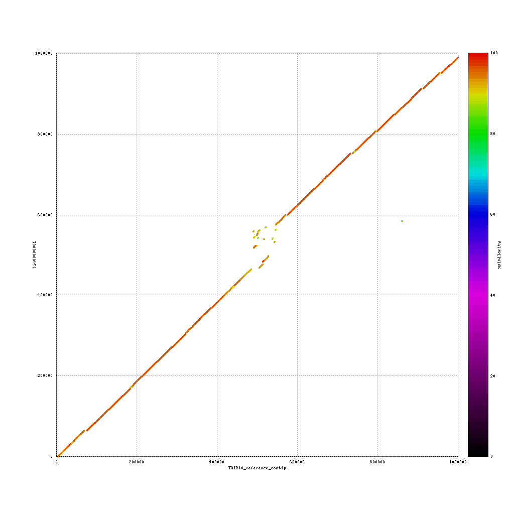
> {: .solution}
> > ## Illumina vs. TAIR10
> >~~~
> >./tools/mummer-4.0.0beta2/nucmer ./data/references/TAIR10_reference1MB.fasta ./results/illumina_assembly_contig.fa  --delta=./results/mummer/tair10_illumina.delta
> >./tools/mummer-4.0.0beta2/mummerplot  --color --medium --filter --layout -R ./data/references/TAIR10_reference1MB.fasta -Q ./results/illumina_assembly_contig.fa  --prefix ./results/mummer/tair10_illumina --fat --png ./results/mummer/tair10_illumina.delta
> >~~~
> >{: .bash}
> >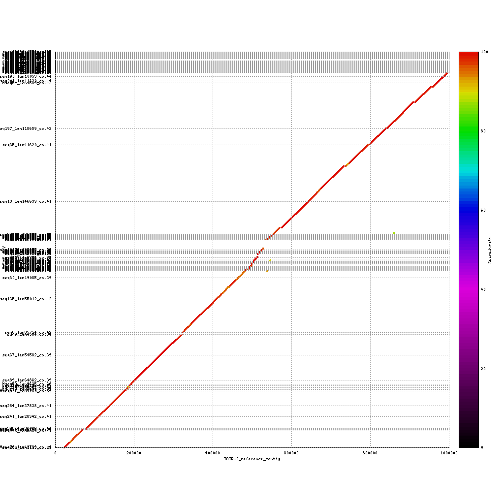
> {: .solution}
> Now discuss:
> 
> 1. What do you see? 
> 2. Are the assemblies similar to the TAIR10 genome or not? Why (not)?
> 3. What does this mean for our cultivar?
{: .challenge}

> ## Repeats in the assemblies
> Mummerplot can also be used to identity repeat regions in the assembly by aligning the assembly to itself. This will provide some insight into repeat content, as these regions are usually (very) difficult to assembly.
> To do this you have to change some of the settings used in the previous calls to nucmer and mummerplot.
> > ## PacBio vs. PacBio
> >~~~
> >./tools/mummer-4.0.0beta2/nucmer --nosimplify --maxmatch ./results/canu_pacbio/canu_pacbio.contigs.fasta ./results/canu_pacbio/canu_pacbio.contigs.fasta --delta=./results/mummer/pacbio_self.delta
> >./tools/mummer-4.0.0beta2/mummerplot  --color --medium --layout -R ./results/canu_pacbio/canu_pacbio.contigs.fasta -Q ./results/canu_pacbio/canu_pacbio.contigs.fasta --prefix ./results/mummer/pacbio_self --fat --png ./results/mummer/pacbio_self.delta
> >~~~
> >{: .bash}
> >Added **--nosimplify --maxmatch** to nucmer and removed **--filter** from mummerplot
> >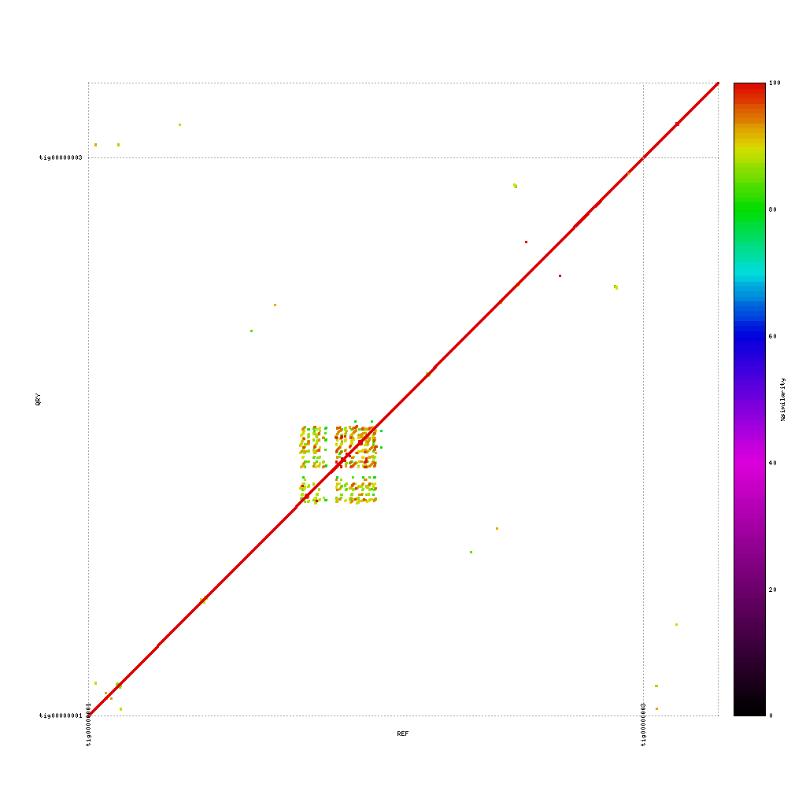
> {: .solution}
> > ## Nanopore vs. Nanopore
> >~~~
> >./tools/mummer-4.0.0beta2/nucmer --nosimplify --maxmatch ./results/canu_nanopore/canu_nanopore.contigs.fasta ./results/canu_nanopore/canu_nanopore.contigs.fasta --delta=./results/mummer/nanopore_self.delta
> >./tools/mummer-4.0.0beta2/mummerplot  --color --medium --layout -R ./results/canu_nanopore/canu_nanopore.contigs.fasta -Q ./results/canu_nanopore/canu_nanopore.contigs.fasta --prefix ./results/mummer/nanopore_self --fat --png ./results/mummer/nanopore_self.delta
> >~~~
> >{: .bash}
> >Added **--nosimplify --maxmatch** to nucmer and removed **--filter** from mummerplot
> >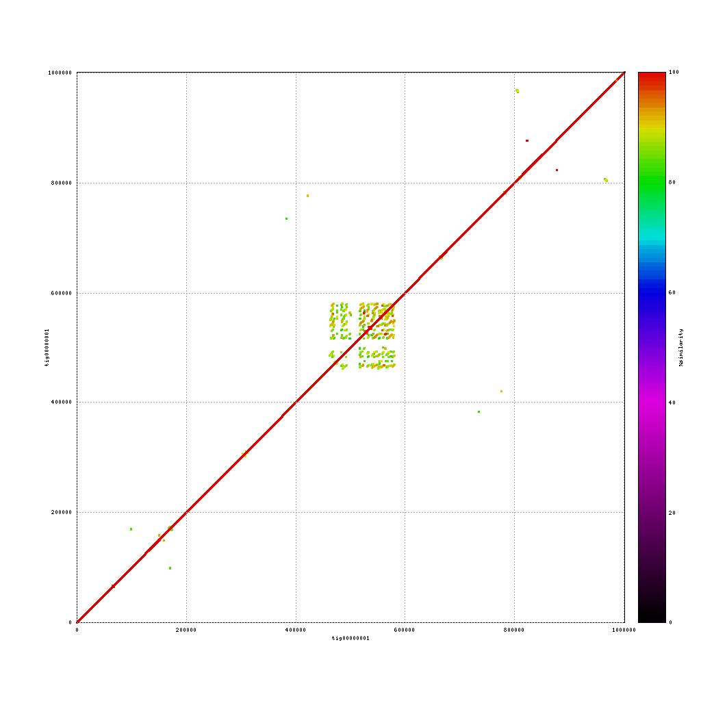
> {: .solution}
> > ## Illumina vs. Illumina
> >~~~
> >./tools/mummer-4.0.0beta2/nucmer --nosimplify --maxmatch ./results/illumina_assembly_contig.fa ./results/illumina_assembly_contig.fa  --delta=./results/mummer/illumina_self.delta
> >./tools/mummer-4.0.0beta2/mummerplot  --color --medium --layout -R ./results/illumina_assembly_contig.fa -Q ./results/illumina_assembly_contig.fa  --prefix ./results/mummer/illumina_self --fat --png ./results/mummer/illumina_self.delta
> >~~~
> >{: .bash}
> >Added **--nosimplify --maxmatch** to nucmer and removed **--filter** from mummerplot
> >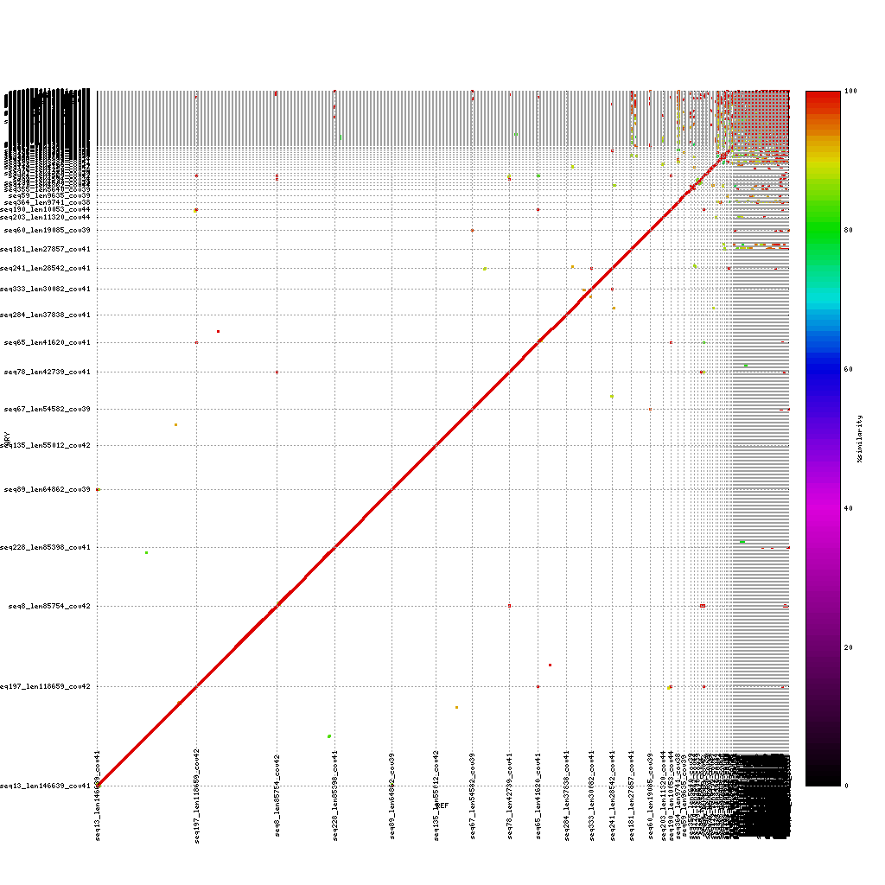
> {: .solution}
> How can you identify repeats in these alignments? And what are the key differences in repeat content when comparing the three platforms?
{: .challenge}

> ## Comparison of assemblies
> In our case we have data from three different platforms. In this exercise you will compare each of the assemblies to the others. In theory these assemblies should match perfectly, as they are from the same samples. However, the number of contigs in each of the assemblies already showed that this is not the case. How do the contigs compare on a nucleotide level?
> > ## PacBio vs. Nanopore
> >~~~
> >./tools/mummer-4.0.0beta2/nucmer --nosimplify --maxmatch ./results/canu_pacbio/canu_pacbio.contigs.fasta ./results/canu_nanopore/canu_nanopore.contigs.fasta --delta=./results/mummer/pacbio_nanopore.delta
> >./tools/mummer-4.0.0beta2/mummerplot  --color --medium --layout -R ./results/canu_pacbio/canu_pacbio.contigs.fasta -Q ./results/canu_nanopore/canu_nanopore.contigs.fasta --prefix ./results/mummer/pacbio_nanopore --fat --png ./results/mummer/pacbio_nanopore.delta
> >~~~
> >{: .bash}
> >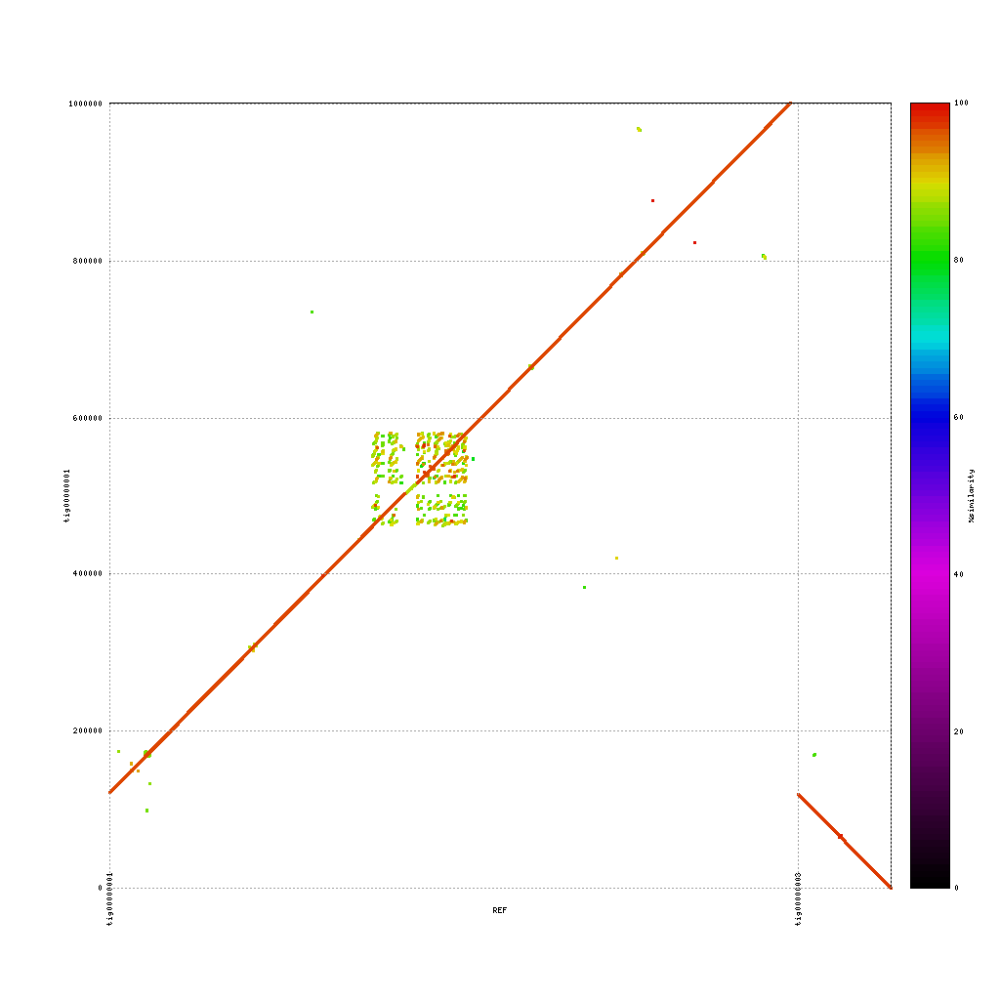
> {: .solution}
> > ## Nanopore vs Illumina
> >~~~
> >./tools/mummer-4.0.0beta2/nucmer --nosimplify --maxmatch ./results/canu_nanopore/canu_nanopore.contigs.fasta ./results/illumina_assembly_contig.fa --delta=./results/mummer/nanopore_illumina.delta
> >./tools/mummer-4.0.0beta2/mummerplot  --color --medium --layout -R ./results/canu_nanopore/canu_nanopore.contigs.fasta -Q ./results/illumina_assembly_contig.fa --prefix ./results/mummer/nanopore_illumina --fat --png ./results/mummer/nanopore_illumina.delta
> >~~~
> >{: .bash}
> >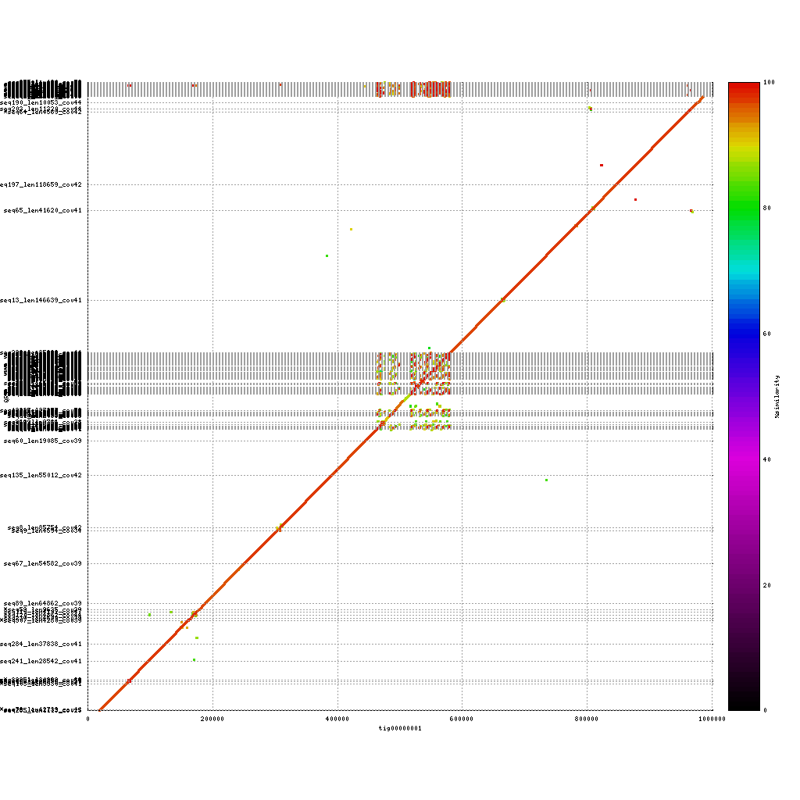
> {: .solution}
> > ## PacBio vs. Illumina
> >~~~
> >./tools/mummer-4.0.0beta2/nucmer --nosimplify --maxmatch ./results/canu_pacbio/canu_pacbio.contigs.fasta ./results/illumina_assembly_contig.fa  --delta=./results/mummer/pacbio_illumina.delta
> >./tools/mummer-4.0.0beta2/mummerplot  --color --medium --layout -R ./results/canu_pacbio/canu_pacbio.contigs.fasta -Q ./results/illumina_assembly_contig.fa  --prefix ./results/mummer/pacbio_illumina --fat --png ./results/mummer/pacbio_illumina.delta
> >~~~
> >{: .bash}
> >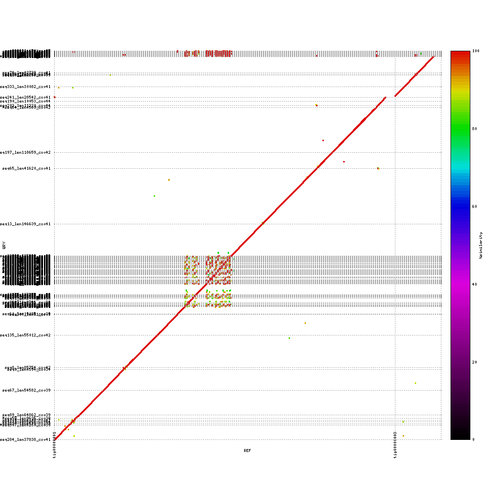
> Please discuss for each of the plots. What stands out? Are you missing parts of the DNA?
> {: .solution}
{: .challenge}

## Putting it all together
In the previous session and in this session we collected information about the raw data and the de novo assemblies.
> ## Best assembly
> Given all the evidence, please indicate which assembly would you prefer and why? Most importantly, indicate which trade-off did you make in selecting (number of contigs, repeat content, basecalling quality, quality of the reads, etc).
{: .challenge} 

